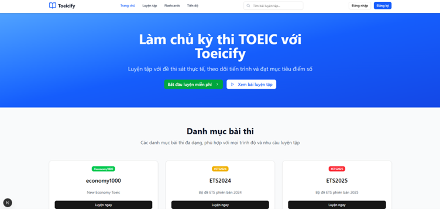
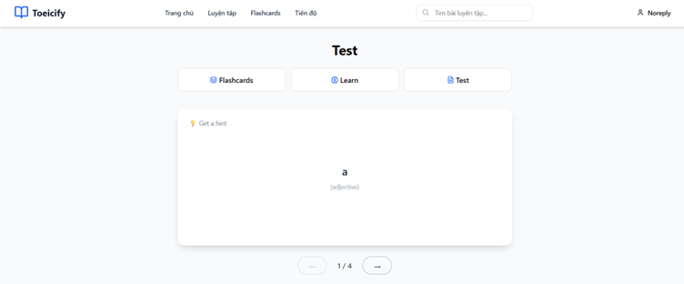
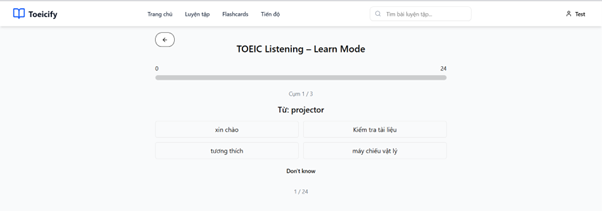

# Toeicify – TOEIC Listening & Reading Practice Platform

Toeicify is a mini web application designed to help learners master the **TOEIC Listening & Reading** test.
It provides realistic practice tests, progress tracking, flashcards, and personalized study insights, with an admin dashboard for exam management and system monitoring.

---

## Table of Contents
1. [Features](#features)
2. [Tech Stack](#tech-stack)
3. [Deployment](#installation)
4. [Background](#background)

---

## Features

### Authentication & User Management

* User registration and login
* Google OAuth integration
* Password recovery
* Account settings and profile management

### TOEIC Practice

* Take tests by **part** or **full exam**
* Automatic scoring with detailed explanations
* Track progress and review past attempts

### Learning Progress

* Personalized study dashboard
* Performance analytics across sections
* Goal tracking
* View History Exam Attempt

### Flashcards

* Vocabulary view, practice, test with flashcards
* Spaced repetition support
* Manage Vocabulary in Flashcard

### Notifications

* Real-time system notifications via **Firebase Cloud Messaging (FCM)**

### Admin Dashboard
* Manage exam, exam categories, exam part, and question in exam
* User management & role control
* Comprehensive statistics and analytics

---
## Tech Stack

* **Frontend:** [Next.js](https://nextjs.org/), [Tailwind CSS](https://tailwindcss.com/)
* **Backend:** [Spring Framework](https://spring.io/)
* **Database:** [PostgreSQL](https://www.postgresql.org/)
* **Cache:** [Redis](https://redis.io/)
* **Notifications:** [Firebase Cloud Messaging (FCM)](https://firebase.google.com/docs/cloud-messaging)
* **Object Storage:** S3-compatible cloud storage
* **Deployment:** [Docker](https://www.docker.com/), [Docker Compose](https://docs.docker.com/compose/)

---

## Deployment

The application is containerized with **Docker** and orchestrated via **Docker Compose** for easy deployment.

---
## Background
### Home

### Login, Register, Forgot Password

### Search, Do, Submit, Check result Exam

### Profile, history attempt exam User

### Overview progress User

### Manage, view, practice, test Flashcard

### Admin Overview

### Manage Exam Category

### Manage Exam

### Manage Exam Detail: exam part, exam question

